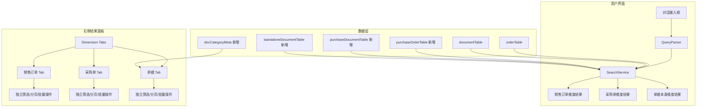
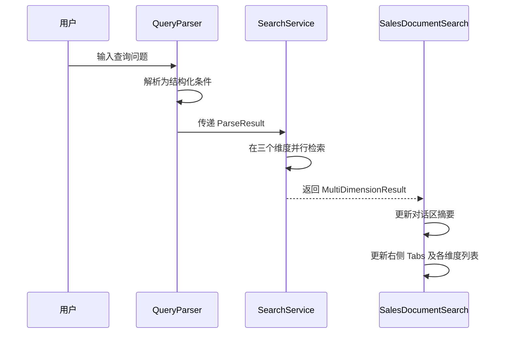

# 设计文档：单据检索多维度扩展

## 概述

本设计将现有单据检索模块从单一"销售订单"维度扩展为三个维度：销售订单、采购单、单据本身。核心改动包括：

1. 新增采购单和独立单据两套数据模型（静态 mock 数据）
2. 扩展 `queryParser` 和 `searchService`，使其支持多维度并行检索
3. 重构右侧结果面板，使用 Ant Design `Tabs` 组件按维度分组展示
4. 每个维度拥有独立的单据类型筛选、分页和批量操作状态
5. 左侧对话区的结果消息和思考过程体现多维度信息

设计原则：最小改动、复用现有组件和样式、保持代码一致性。

## 架构

### 整体架构图



### 数据流



## 组件与接口

### 1. 数据文件（新增）

#### `src/data/purchaseOrderTable.js`
采购订单主表，结构类似 `orderTable`，字段包括：
- `purchaseOrderNo`（主键）、`supplier`（供应商名称）、`purchaseDate`、`purchaseAmount`、`currency`、`purchaseType`、`status` 等

#### `src/data/purchaseDocumentTable.js`
采购单据关联表，结构类似 `documentTable`，通过 `purchaseOrderNo` 关联：
- `id`、`purchaseOrderNo`、`type`、`name`、`tag`、`tagColor`、`path`

#### `src/data/standaloneDocumentTable.js`
独立单据表，以文件本身为主体：
- `id`、`fileName`、`docCategory`（单据类型）、`fileFormat`
- `structuredFields`：一个对象，包含该类单据特有的结构化字段值

#### `src/data/docCategoryMeta.js`
单据类型元数据配置，定义每种 `docCategory` 的结构化字段：
```js
{
  '合同': {
    fields: [
      { key: 'contractNo', label: '合同编号', type: 'string' },
      { key: 'partyA', label: '甲方', type: 'string' },
      { key: 'partyB', label: '乙方', type: 'string' },
      { key: 'signDate', label: '签订日期', type: 'date' },
      { key: 'amount', label: '合同金额', type: 'number' },
    ]
  },
  // ...其他类型
}
```

### 2. QueryParser 扩展

`parseQuery` 返回的 `ParseResult` 结构不变，但 `searchService` 会将同一组条件分别应用到三个维度。无需修改 parser 的核心逻辑，只需：
- 在 `KNOWN_DOC_TAGS` 中补充新增的单据类型关键词（技术协议、出厂试验报告、质量异议处理单、质保书）
- 在 `FIELD_MAP` 中补充采购单相关字段映射（供应商、采购日期等）

### 3. SearchService 扩展

新增 `executeMultiDimensionSearch` 函数：

```js
/**
 * @typedef {Object} MultiDimensionResult
 * @property {Object} sales - 销售订单维度结果 { orders, total, summary, ... }
 * @property {Object} purchase - 采购单维度结果 { orders, total, summary, ... }
 * @property {Object} document - 单据本身维度结果 { documents, total, summary, ... }
 * @property {string} overallSummary - 综合摘要
 */
export function executeMultiDimensionSearch(parseResult, orderTable, documentTable, purchaseOrderTable, purchaseDocumentTable, standaloneDocumentTable) {
  // 1. 销售订单维度：复用现有 executeSearch
  // 2. 采购单维度：类似逻辑，以 purchaseOrderTable 为主表
  // 3. 单据本身维度：直接在 standaloneDocumentTable 中按条件过滤
  // 4. 生成综合摘要
}
```

### 4. SalesDocumentSearch 组件重构

核心状态变更：

```js
// 各维度独立状态
const [activeDimension, setActiveDimension] = useState('sales'); // 当前激活的维度 Tab
const [dimensionResults, setDimensionResults] = useState({
  sales: { orders: [], total: 0 },
  purchase: { orders: [], total: 0 },
  document: { documents: [], total: 0 },
});

// 每个维度独立的筛选、分页、选中状态
const [dimensionFilters, setDimensionFilters] = useState({
  sales: { selectedDocTypes: ['__ALL__'], currentPage: 1, pageSize: 10, selectedItems: [], expandedItems: [] },
  purchase: { selectedDocTypes: ['__ALL__'], currentPage: 1, pageSize: 10, selectedItems: [], expandedItems: [] },
  document: { selectedDocTypes: ['__ALL__'], currentPage: 1, pageSize: 10, selectedItems: [], expandedItems: [] },
});
```

右侧面板结构：

```jsx
<Tabs activeKey={activeDimension} onChange={setActiveDimension}>
  <TabPane tab={`销售订单 (${dimensionResults.sales.total})`} key="sales">
    {/* 复用现有卡片式列表 + 独立筛选/分页 */}
  </TabPane>
  <TabPane tab={`采购单 (${dimensionResults.purchase.total})`} key="purchase">
    {/* 类似销售订单的卡片式列表 */}
  </TabPane>
  <TabPane tab={`单据 (${dimensionResults.document.total})`} key="document">
    {/* 以文件名为主的列表，动态结构化字段 */}
  </TabPane>
</Tabs>
```

### 5. 销售订单维度单据类型补充

在 `documentTable.js` 中为现有订单补充以下类型的文件记录：
- 技术协议（tagColor: `'#2db7f5'` 浅蓝）
- 出厂试验报告（tagColor: `'#87d068'` 浅绿）
- 质量异议处理单（tagColor: `'#f50'` 红橙）
- 质保书（tagColor: `'#108ee9'` 深蓝）

同时在 `queryParser.js` 的 `KNOWN_DOC_TAGS` 数组中添加这四种类型。

### 6. 对话区多维度展示

思考过程步骤从 2 步扩展为 4 步：
1. 理解问题
2. 在销售单据中检索
3. 在采购单据中检索
4. 在独立单据中检索

结果消息的摘要格式：
> 共检索到销售订单 X 条，采购单 Y 条，单据 Z 份。[各维度详细摘要]

## 数据模型

### 采购订单主表 (purchaseOrderTable)

| 字段 | 类型 | 说明 |
|------|------|------|
| purchaseOrderNo | string | 采购订单号（主键） |
| supplier | string | 供应商名称 |
| purchaseDate | string | 采购日期 |
| purchaseAmount | string | 采购金额 |
| currency | string | 币种 |
| purchaseType | string | 采购类型 |
| relatedSalesOrder | string | 关联销售订单号 |
| status | string | 状态 |
| description | string | 描述 |

### 采购单据关联表 (purchaseDocumentTable)

| 字段 | 类型 | 说明 |
|------|------|------|
| id | string | 文件 ID（主键） |
| purchaseOrderNo | string | 采购订单号（外键） |
| type | string | 文件格式（pdf/image） |
| name | string | 文件名称 |
| tag | string | 文件标签 |
| tagColor | string | 标签颜色 |
| path | string | 文件路径 |

### 独立单据表 (standaloneDocumentTable)

| 字段 | 类型 | 说明 |
|------|------|------|
| id | string | 文件 ID（主键） |
| fileName | string | 文件名称 |
| docCategory | string | 单据类型 |
| fileFormat | string | 文件格式 |
| structuredFields | object | 该类单据特有的结构化字段值 |

### 单据类型元数据 (docCategoryMeta)

| 字段 | 类型 | 说明 |
|------|------|------|
| [docCategory] | object | 以单据类型为 key |
| fields | array | 结构化字段定义数组 |
| fields[].key | string | 字段键名 |
| fields[].label | string | 字段中文标签 |
| fields[].type | string | 字段类型（string/number/date） |

### MultiDimensionResult 结构

```js
{
  sales: {
    orders: [...],      // 销售订单数组（含 documents）
    total: number,
    summary: string,
    orderColumns: [...],
    queryFocus: string[] | null,
  },
  purchase: {
    orders: [...],      // 采购订单数组（含 documents）
    total: number,
    summary: string,
  },
  document: {
    documents: [...],   // 独立单据数组
    total: number,
    summary: string,
  },
  overallSummary: string,  // 综合摘要
}
```


## 正确性属性

*属性（Property）是指在系统所有有效执行中都应成立的特征或行为——本质上是对系统应做什么的形式化陈述。属性是人类可读规格说明与机器可验证正确性保证之间的桥梁。*

### Property 1: 采购单据数据完整性

*For any* purchaseDocumentTable 中的记录，该记录应包含非空的 id、purchaseOrderNo、type、name、tag、path 字段，且其 purchaseOrderNo 应在 purchaseOrderTable 中存在。

**Validates: Requirements 1.2, 1.3**

### Property 2: 采购订单号唯一性

*For any* purchaseOrderTable 中的两条不同记录，它们的 purchaseOrderNo 字段值应不相同。

**Validates: Requirements 1.4**

### Property 3: 独立单据数据完整性

*For any* standaloneDocumentTable 中的记录，该记录应包含非空的 id、fileName、docCategory、fileFormat 字段，且其 docCategory 应在 docCategoryMeta 中有对应的元数据定义，该定义的 fields 数组中每个元素应包含 key、label、type。

**Validates: Requirements 2.2, 2.5**

### Property 4: 同类型结构化字段一致性

*For any* standaloneDocumentTable 中属于同一 docCategory 的两条记录，它们的 structuredFields 对象应拥有完全相同的 key 集合。

**Validates: Requirements 2.3**

### Property 5: 查询解析有效性

*For any* 非空字符串输入，parseQuery 应返回一个包含 conditions 数组（可为空）和 queryType 字段（值为 'list' 或 'aggregation'）的有效 ParseResult 对象。

**Validates: Requirements 3.1**

### Property 6: 多维度检索结果完整性

*For any* 有效的 ParseResult，executeMultiDimensionSearch 返回的结果应包含 sales、purchase、document 三个键，每个键对应的值应包含 total（非负整数）字段。

**Validates: Requirements 3.2, 3.3**

### Property 7: 综合摘要包含各维度数量

*For any* executeMultiDimensionSearch 返回的 MultiDimensionResult，其 overallSummary 字符串应包含销售订单、采购单、单据三个维度各自的命中数量数值。

**Validates: Requirements 3.5, 9.1**

### Property 8: 文档类型过滤正确性

*For any* 文档列表和非空的类型筛选集合（不含 '__ALL__'），过滤后的结果中每个文档的 tag 应属于选中的类型集合，且原列表中所有 tag 属于选中类型集合的文档都应出现在过滤结果中。

**Validates: Requirements 5.2, 5.5**

### Property 9: 标签颜色唯一性

*For any* documentTable 中的两种不同 tag，它们对应的 tagColor 应不相同。

**Validates: Requirements 6.3**

## 错误处理

| 场景 | 处理方式 |
|------|----------|
| 查询解析无法识别任何条件 | 返回全量结果（三个维度均返回全部数据），与现有行为一致 |
| 某个维度数据源为空或未定义 | 该维度返回 `{ orders/documents: [], total: 0, summary: '暂无数据' }` |
| 某个维度检索无结果 | 在该维度 Tab 中展示空状态提示"暂无匹配的记录" |
| 独立单据的 docCategory 在 docCategoryMeta 中无定义 | 仅展示通用字段（文件名、单据类型、文件格式），不展示结构化字段 |
| 采购单据的 purchaseOrderNo 在主表中不存在 | 忽略该条记录，不在结果中展示 |

## 测试策略

### 单元测试

- `queryParser.js`：验证新增单据类型关键词（技术协议、出厂试验报告、质量异议处理单、质保书）的解析
- `searchService.js`：验证 `executeMultiDimensionSearch` 在各种条件下的返回结构和数据正确性
- 数据模型完整性：验证新增数据表的字段完整性和关联正确性
- 文档类型过滤函数：验证 `getFilteredDocuments` 在各种筛选条件下的行为

### 属性测试

本项目使用 `fast-check` 作为属性测试库（需新增依赖）。

每个属性测试配置最少 100 次迭代，每个测试用注释标注对应的设计属性：

```
// Feature: document-search-multi-dimension, Property 1: 采购单据数据完整性
// Feature: document-search-multi-dimension, Property 5: 查询解析有效性
```

属性测试重点覆盖：
- 数据模型完整性和一致性（Property 1-4, 9）
- 查询解析的鲁棒性（Property 5）
- 多维度检索结果结构完整性（Property 6-7）
- 文档类型过滤的正确性（Property 8）

### 集成测试

- 端到端检索流程：输入查询 → 解析 → 多维度检索 → 结果展示
- 维度切换时状态隔离：各维度的筛选、分页、选中状态互不影响
- 对话区与右侧面板的联动：点击"查看订单列表"正确切换右侧面板
