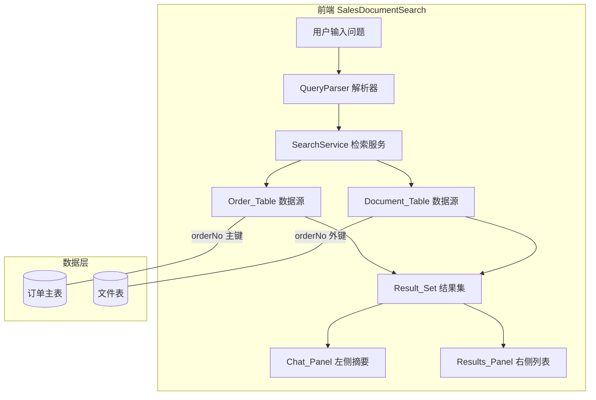
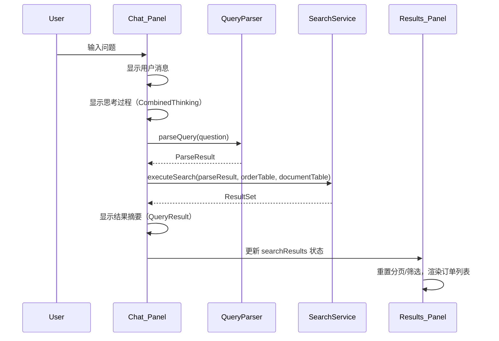

# Design Document: 单据检索

## Overview

基于现有 `SalesDocumentSearch` 组件的对话式交互架构，重构数据层和查询逻辑，实现：
1. 将订单详情和文件信息拆分为两个独立数据源（Order_Table / Document_Table），通过 `orderNo` 关联
2. 新增查询条件解析引擎，将自然语言转换为结构化查询条件
3. 查询结果同时驱动左侧 `Chat_Panel`（AI 摘要）和右侧 `Results_Panel`（订单列表）

现有的 `CombinedThinking`（思考过程动画）、`QueryResult`（结果展示）、`DocumentConversationContext`（对话历史管理）等组件保持复用，仅调整数据流入口。

## Architecture



整体数据流：
1. 用户在 `Chat_Panel` 输入自然语言问题
2. `QueryParser` 将问题解析为 `QueryCondition[]`
3. `SearchService` 根据条件在 `Order_Table` 和 `Document_Table` 中执行查询
4. 返回 `ResultSet`，同时更新左侧摘要消息和右侧订单列表状态

## Components and Interfaces

### 1. QueryParser（查询条件解析器）

位置：`src/utils/queryParser.js`

职责：将自然语言问题解析为结构化查询条件数组。

```javascript
/**
 * 查询条件
 * @typedef {Object} QueryCondition
 * @property {string} field - 字段名（Order_Table 或 Document_Table 的字段）
 * @property {'eq'|'gt'|'lt'|'gte'|'lte'|'contains'|'in'} operator - 运算符
 * @property {string|number|string[]} value - 匹配值
 * @property {'order'|'document'} table - 目标表
 */

/**
 * 解析结果
 * @typedef {Object} ParseResult
 * @property {QueryCondition[]} conditions - 条件数组（AND 逻辑）
 * @property {'list'|'aggregation'} queryType - 查询类型
 * @property {Object|null} aggregation - 聚合配置（仅 queryType='aggregation' 时）
 * @property {string} description - 条件的自然语言描述
 */

/**
 * 解析自然语言问题为结构化查询条件
 * @param {string} question - 用户输入的自然语言问题
 * @returns {ParseResult}
 */
function parseQuery(question) { ... }
```

解析策略（基于关键词和正则匹配）：

| 用户输入模式 | 解析结果 |
|---|---|
| "XXX订单号" | `{ field: 'orderNo', operator: 'eq', value: 'XXX', table: 'order' }` |
| "有中标通知书的" | `{ field: 'tag', operator: 'eq', value: '中标通知书', table: 'document' }` |
| "2025年之后" | `{ field: 'poDate', operator: 'gte', value: '2025-01-01', table: 'order' }` |
| "金额大于200万" | `{ field: 'amount', operator: 'gt', value: 2000000, table: 'order' }` |
| "十大客户" | `queryType: 'aggregation', aggregation: { groupBy: 'customer', orderBy: 'amount', limit: 10 }` |

### 2. SearchService（检索服务）

位置：`src/utils/searchService.js`

职责：根据解析后的条件在数据源中执行查询，返回统一的 `ResultSet`。

```javascript
/**
 * 结果集
 * @typedef {Object} ResultSet
 * @property {Order[]} orders - 命中的订单列表（含关联文件）
 * @property {number} total - 命中总数
 * @property {string} summary - 摘要文本
 * @property {string[]} usedFields - 使用的查询字段名
 * @property {string} conditionDesc - 查询条件描述
 * @property {Object|null} aggregation - 聚合结果（表格列定义 + 数据行）
 */

/**
 * 执行检索
 * @param {ParseResult} parseResult - 解析后的查询条件
 * @param {Order[]} orderTable - 订单数据源
 * @param {Document[]} documentTable - 文件数据源
 * @returns {ResultSet}
 */
function executeSearch(parseResult, orderTable, documentTable) { ... }
```

查询执行逻辑：
1. 分离 `order` 条件和 `document` 条件
2. 先用 `order` 条件过滤 `orderTable`
3. 如果有 `document` 条件，用 `document` 条件过滤 `documentTable`，取出匹配的 `orderNo` 集合，再与步骤 2 的结果取交集
4. 为每个命中订单关联其文件列表
5. 如果是聚合查询，执行分组统计
6. 生成摘要文本和结果集

### 3. 数据源模块

位置：`src/data/orderTable.js` 和 `src/data/documentTable.js`

将现有 `mockResults` 拆分为两个独立数据源。

### 4. SalesDocumentSearch 组件改造

保持现有的双面板布局和对话流程，核心改动：

- 新增 `searchResults` 状态，存储当前查询的 `ResultSet`
- `handleDocSendMessage` 中调用 `parseQuery` → `executeSearch`，用真实结果替代硬编码 mock
- 右侧 `Results_Panel` 的数据源从 `mockResults` 改为 `searchResults.orders`
- 分页、筛选、选择等现有功能保持不变，数据源切换为动态结果



## Data Models

### Order（订单主表记录）

```javascript
{
  orderNo: string,          // 销售凭证号（主键）
  poDate: string,           // 凭证日期
  soldTo: string,           // 售达方
  customer: string,         // 客户名称
  customerContractNo: string, // 客户合同编号
  title: string,            // 项目名称
  salesOfficeDesc: string,  // 销售代表处描述
  salesRepDesc: string,     // 销售代表描述
  salesRegionDesc: string,  // 销售地区描述
  amountExclTax: string,    // 订单不含税金额合计
  totalAmountCNY: string,   // 合同总金额(CNY)
  totalAmountOrder: string, // 合同总金额
  amount: string,           // 金额（用于列表展示和查询）
  currency: string,         // 货币
  channelDesc: string,      // 分销渠道描述
  holdingCompany: string,   // 控股方
  industryCode: string,     // 用户行业(披露口径)
  industryDesc: string,     // 用户行业(披露口径)描述
  taxRate: string,          // 税率
  quotationNo: string,      // 报价单编号
  vatInvoiceNo: string,     // VAT发票号
  vatInvoiceDate: string,   // VAT发票时间
  vatInvoiceRate: string,   // VAT发票税率
  vatInvoiceAmount: string, // VAT发票金额
  paymentDate: string,      // 回款时间
  paymentAmount: string,    // 回款金额
  paymentCurrency: string,  // 交易货币
  outstandingAmount: string,// 欠款金额
  contractDebt: string,     // 合同欠款金额
  paymentTerms: string,     // 付款条件备注
}
```

### Document（文件表记录）

```javascript
{
  id: string,         // 文件ID
  orderNo: string,    // 关联订单号（外键）
  type: string,       // 文件格式类型（pdf/image/word）
  name: string,       // 文件名称
  tag: string,        // 文件标签（合同/发票/中标通知书/运行证明等）
  tagColor: string,   // 标签颜色
  path: string,       // 文件路径
}
```

### ResultSet（查询结果集）

```javascript
{
  orders: Order[],              // 命中订单（每个订单附带 documents 数组）
  total: number,                // 命中总数
  summary: string,              // 摘要文本
  usedFields: string[],         // 使用的查询字段
  conditionDesc: string,        // 条件描述
  aggregation: {                // 聚合结果（可选）
    columns: TableColumn[],     // 表格列定义
    dataSource: Object[],       // 表格数据行
  } | null,
}
```

</text>
</invoke>

## Correctness Properties

*A property is a characteristic or behavior that should hold true across all valid executions of a system — essentially, a formal statement about what the system should do. Properties serve as the bridge between human-readable specifications and machine-verifiable correctness guarantees.*

### Property 1: Order-Document 关联正确性

*For any* order in the result set, its `documents` array should contain exactly the documents from Document_Table whose `orderNo` matches the order's `orderNo`, and no others.

**Validates: Requirements 1.4, 5.5, 7.3**

### Property 2: AND 逻辑查询正确性

*For any* set of query conditions and any order data, every order in the search result should satisfy ALL conditions simultaneously. No order that fails any single condition should appear in the results.

**Validates: Requirements 2.2**

### Property 3: 文件类型跨表查询正确性

*For any* document type filter condition, every order in the search result should have at least one associated document in Document_Table with a matching `tag` value.

**Validates: Requirements 2.3**

### Property 4: 聚合查询正确性

*For any* aggregation query with `groupBy`, `orderBy`, and `limit` parameters, the aggregation result should be sorted in descending order by the specified field and contain at most `limit` entries.

**Validates: Requirements 2.4**

### Property 5: 解析器输出结构有效性

*For any* parseable user question, the `parseQuery` function should return a `ParseResult` where every `QueryCondition` has a non-empty `field`, a valid `operator` from the allowed set, and a non-null `value`.

**Validates: Requirements 3.1**

### Property 6: 文件类型条件定向正确性

*For any* user question that mentions a known document type (合同/发票/中标通知书/运行证明等), the parsed conditions should include at least one condition with `table: 'document'` and `field: 'tag'`.

**Validates: Requirements 3.3**

### Property 7: 字段值规范化正确性

*For any* user question containing time expressions (如"2025年之后") or amount expressions (如"大于200万"), the parser should produce conditions with correctly normalized values — dates as ISO-comparable strings, amounts as numeric values.

**Validates: Requirements 3.4, 3.5**

### Property 8: 摘要信息完整性

*For any* non-empty search result, the `summary` string should contain the total count of matched orders and at least one used field name.

**Validates: Requirements 4.1**

### Property 9: 对话历史单调递增

*For any* sequence of user queries, the messages array length should be monotonically non-decreasing — each new query adds messages without removing existing ones.

**Validates: Requirements 4.5**

### Property 10: 查询结果替换面板数据

*For any* search execution that returns N orders, the Results_Panel should display exactly those N orders (subject to pagination).

**Validates: Requirements 5.1**

### Property 11: 搜索重置 UI 状态

*For any* search execution, after results are applied, `currentPage` should be 1, `selectedItems` should be empty, and `selectedDocumentTypes` should be `['__ALL__']`.

**Validates: Requirements 5.2, 5.3**

### Property 12: ResultSet 结构完整性

*For any* search execution, the returned `ResultSet` should contain `orders` (array), `total` (number), `summary` (string), `usedFields` (array), and `conditionDesc` (string).

**Validates: Requirements 7.1**

### Property 13: 聚合结果结构

*For any* aggregation query, the `ResultSet.aggregation` should be non-null and contain `columns` (array with at least one column) and `dataSource` (array).

**Validates: Requirements 7.2**

### Property 14: 引用完整性

*For any* document in Document_Table, its `orderNo` should correspond to an existing order in Order_Table.

**Validates: Requirements 1.3**

## Error Handling

| 场景 | 处理方式 |
|---|---|
| 用户输入无法解析为有效条件 | `parseQuery` 返回空条件数组，`executeSearch` 返回全量数据并在 summary 中提示"未识别到具体查询条件，已展示全部订单" |
| 查询结果为空 | `ResultSet.orders` 为空数组，`summary` 显示"未找到符合条件的订单，请尝试调整查询条件"，右侧面板显示空状态 |
| 金额/日期格式无法解析 | 跳过该条件，在 summary 中提示"部分条件未能识别" |
| 文件类型不存在于数据中 | 正常返回空结果，提示"未找到包含该类型文件的订单" |

## Testing Strategy

### 测试框架

- 单元测试：Jest（CRA 内置）
- 属性测试：fast-check（需安装 `fast-check` 包）

### 单元测试

针对具体示例和边界情况：
- `QueryParser`：测试各种问题模式的解析结果（订单号查询、文件类型查询、组合条件、聚合查询、无效输入）
- `SearchService`：测试单条件/多条件/跨表/聚合查询的执行结果
- 数据关联：测试 Order_Table 和 Document_Table 的关联正确性

### 属性测试

每个 Correctness Property 对应一个 property-based test，使用 `fast-check` 生成随机输入，最少运行 100 次迭代。

每个测试需标注：`Feature: document-search, Property N: {property_text}`

测试重点：
- 生成随机订单和文件数据，验证关联查询的正确性
- 生成随机查询条件组合，验证 AND 逻辑和结果过滤
- 生成随机自然语言模式，验证解析器输出结构
- 生成随机搜索结果，验证 UI 状态重置
